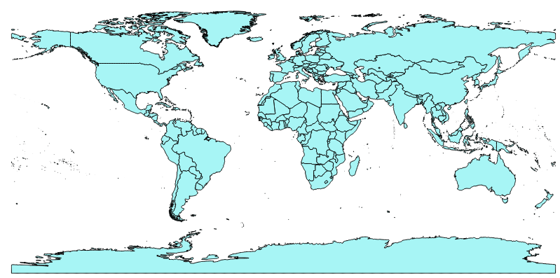
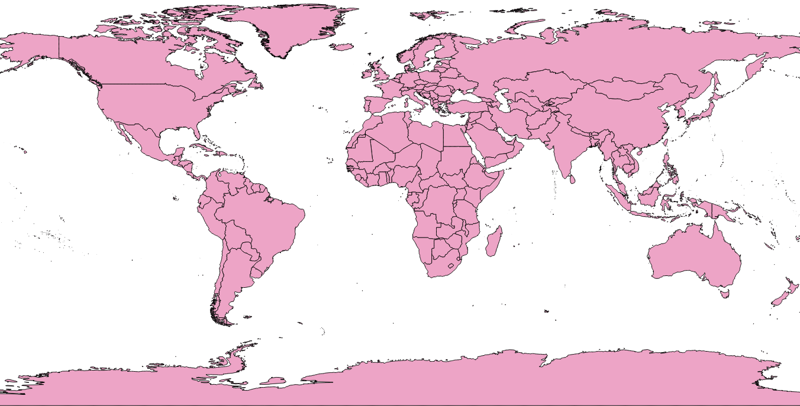

## World Map

The Shapefile includes all countries of the world. The shapefile, downloaded from the https://www.naturalearthdata.com/
 website, showed India incorrectly (as shown below).

!

I have removed the incorrect boundaries of India and added the correct shapefile. The final result is like this.

P.S. Please let me know if there are any other topographical or geographic errors which need to be corrected.
